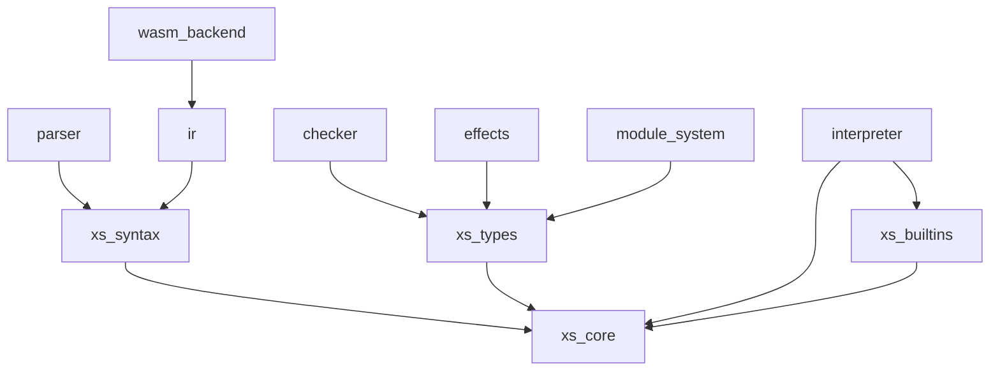

# XS Language Architecture - モジュール責務分担

## 単一責任原則に基づくモジュール構成

### 1. `xs_core` - 言語コア定義
**責務**: 言語の基本的なデータ構造と共通定義

- **AST定義**: 構文木の構造（`Expr`, `Pattern`, `Literal`, `Ident`, `Span`）
- **型定義**: 型システムの基本構造（`Type`, `TypeDefinition`）
- **値定義**: 実行時の値表現（`Value`, `Environment`）
- **エラー型**: 共通エラー型（`XsError`）

### 2. `xs_syntax` (将来的な分離案)
**責務**: 構文に関する全て

- **AST定義**: `xs_core`から移動
- **Pretty Print**: ASTの表示
- **メタデータ**: ASTメタデータ管理

### 3. `xs_types` (将来的な分離案)
**責務**: 型システムのコア定義

- **型定義**: `Type`, `TypeDefinition`を`xs_core`から移動
- **型スキーム**: `TypeScheme`
- **エフェクト型**: `Effect`, `EffectRow`, `EffectSet`

### 4. `checker` - 型チェックと推論
**責務**: 型の検証と推論のみ

- **型推論**: Hindley-Milner型推論エンジン
- **型環境管理**: `TypeEnv`の管理
- **型エラー報告**: 型関連のエラーメッセージ生成

### 5. `xs_builtins` (将来的な分離案)
**責務**: ビルトイン関数の定義と実装

- **ビルトイン関数**: `BuiltinFunction`, `BuiltinRegistry`
- **標準ライブラリ**: 基本的な関数の実装

### 6. `parser` - 構文解析
**責務**: テキストからASTへの変換

- **字句解析**: トークン分割
- **構文解析**: S式パース
- **エラー報告**: パースエラーの詳細

### 7. `interpreter` - 実行エンジン
**責務**: ASTの実行

- **評価器**: `eval`関数
- **環境管理**: 実行時環境の管理
- **ビルトイン実行**: ビルトイン関数の実行

### 8. `ir` (将来的な分離案)
**責務**: 中間表現と最適化

- **IR定義**: 中間表現の構造
- **IR変換**: ASTからIRへの変換
- **最適化**: IR上での最適化

### 9. `effects` (将来的な分離案)
**責務**: エフェクトシステム

- **エフェクト推論**: `effect_inference.rs`
- **エフェクトハンドラ**: エフェクトの実行

### 10. `module_system` (将来的な分離案)
**責務**: モジュールシステム

- **モジュール解決**: インポート/エクスポート
- **モジュール環境**: `ModuleEnv`, `ModuleInfo`

## リファクタリング方針

### Phase 1: 最小限の整理
1. `xs_core`から`builtins`を独立したクレートに分離
2. `checker`から`module_env`を分離

### Phase 2: 型システムの分離
1. `xs_types`クレートを作成し、型関連の定義を移動
2. `effects`を独立したクレートに

### Phase 3: 構文の分離
1. `xs_syntax`クレートを作成し、AST関連を移動
2. `ir`を独立したクレートに

## 依存関係

## メリット

1. **明確な責務分離**: 各モジュールが単一の責任を持つ
2. **再利用性の向上**: 必要な部分だけを使用可能
3. **テストの容易さ**: 各モジュールを独立してテスト可能
4. **並列開発**: チームで異なるモジュールを並行して開発可能
5. **理解しやすさ**: 各モジュールの目的が明確

## 実装の優先順位

1. **高優先度**: `xs_builtins`の分離（現在のビルトイン関数実装が大きいため）
2. **中優先度**: `xs_types`の分離（型システムの独立性を高める）
3. **低優先度**: `xs_syntax`の分離（現状でも問題ないため）