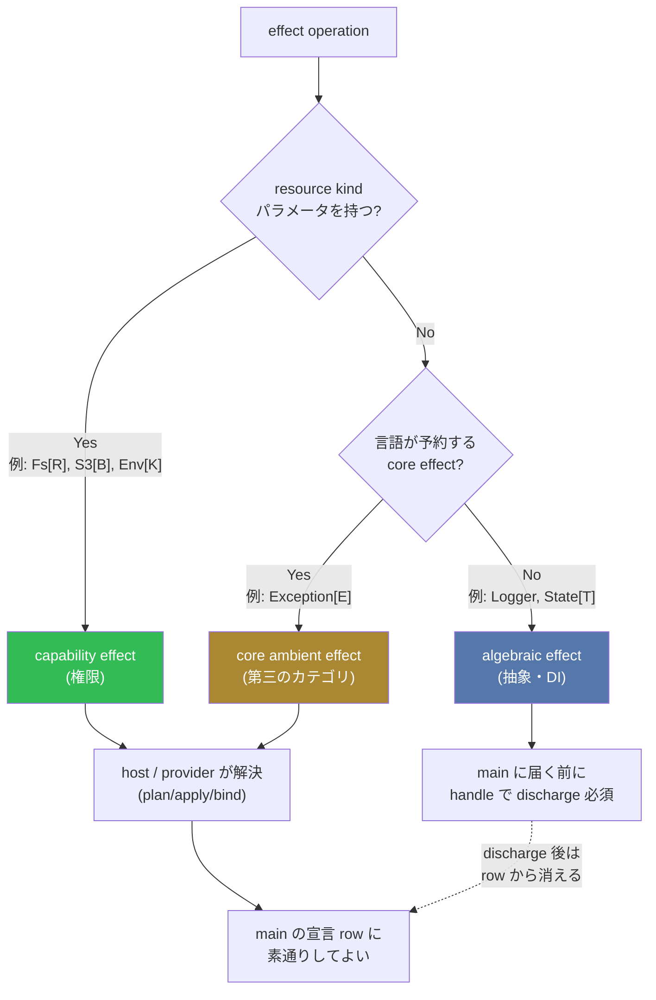
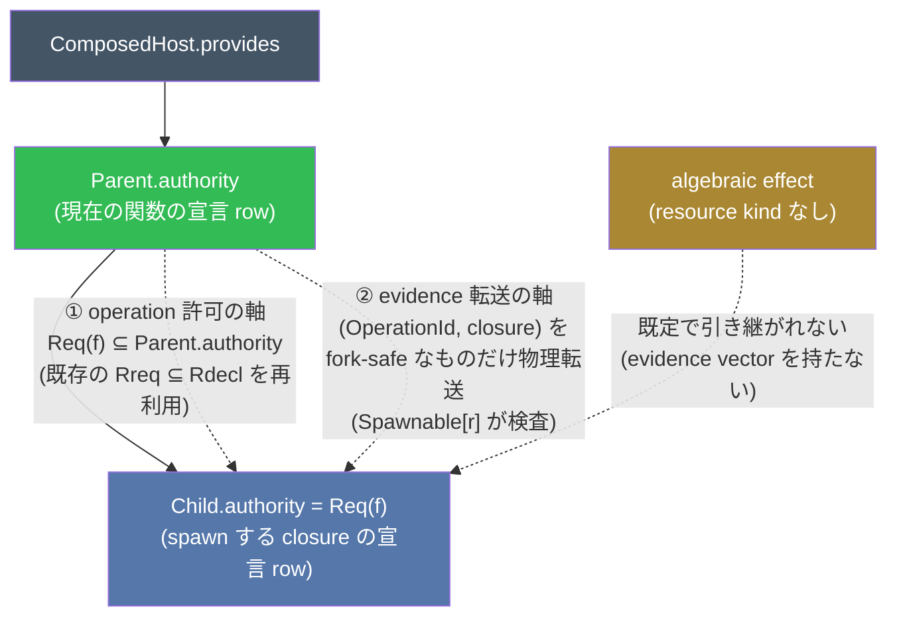
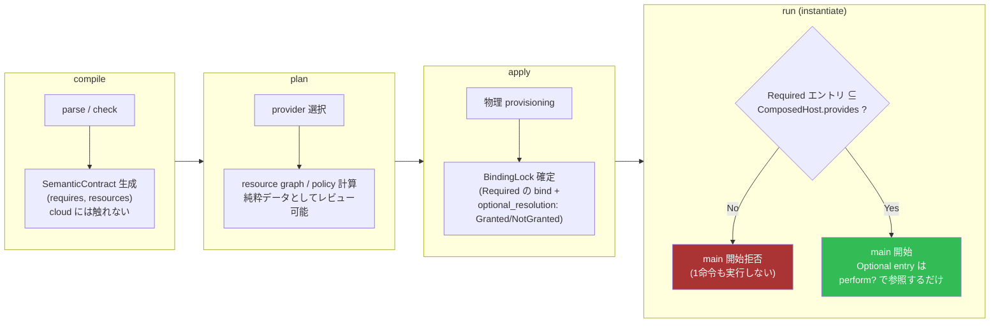

# Effect 分類レビュー: capability effect と algebraic effect の整理

> **位置づけ**: これは ADR ではない。`docs/adr.md` の凡例(accepted/proposed/
> deferred/superseded)には従わず、`docs/adr.md` にまだ登録されていない
> 設計上の論点を横断的に整理するレビュー文書。ここで方向性が固まった項目
> から、既存の ADR-0071 / ADR-0075 / ADR-0060 / ADR-0068 / ADR-0073 の
> `Related` として、個別の小さい ADR に順次切り出すことを想定している。
> 既存の Effect 関連 ADR が意図的に小さく分割されているスタイル(1つの
> 巨大 ADR にしていない)を踏襲する。

## 背景

vibe の `effect` / `with { }` 構文は [Koka](https://koka-lang.github.io/koka/doc/book.html#sec-effect-types)
を参考にした代数的エフェクト(抽象・DI 用途、例: ジェネレータの `Yield`)
を志向して設計されたが、実際の実装は [Deno](https://docs.deno.com/runtime/fundamentals/security/)
由来の「権限としての Effect」(`Fs` / `Env` / `Process` / `HttpServer` など
の粗粒度な capability grant)に寄っている。結果として、**同じ構文・同じ
`effect` キーワードに2つの異なる意味論が混在している**。

- **権限としての Effect**: `read`, `write`, `Network` のような、外部
  リソースへのアクセス許可。本来は wasm 境界の外の import や WIT との
  契約として宣言されるべきもの。
- **抽象・DI としての Effect**: Koka/Effekt が志向する代数的エフェクト。
  handler による複数実装の切り替えが可能で、wasm 境界とは無関係。

この文書は、この混在をどう型レベルで区別し、両者を一貫した文法・意味論
の上に載せ直すかを検討する。

### 全体像



resource kind パラメータの有無が第一の分岐点であり、無い場合はさらに
「言語が予約する core effect(`Exception` など)か、ユーザー定義の
algebraic effect か」で扱いが分かれる。capability effect と core ambient
effect は `main` の row を素通りできるが、algebraic effect は必ず
`handle` で discharge されてから `main` に届く必要がある。

## 前提となる既存 ADR

| ADR/Issue | 内容 | 状態 |
| --- | --- | --- |
| ADR-0050 | `handle`/`perform`/`resume` の正式構文。`Error` は built-in effect、`throw` は sugar | proposed |
| ADR-0071 | `effectset` — operation-level effect row(`Env::get` 単位の細粒度)。6項目中5項目が実装済み | proposed(ほぼ実装済) |
| ADR-0075 | `.vibex` runtime contract。semantic requirement と resource claim の分離、`S3[Posts]::get_object` 型の resource-qualified operation、compile/plan/apply/run のフェーズ分離、task/spawn authority delegation | proposed(Phase 0 完了、Phase 1 一部) |
| ADR-0060 | `let mut` と cross-scope write を `Write[r]`(Koka の `st<h>` 風 region)に統一する案 | proposed(停滞) |
| ADR-0073 | `Error` を完全 checked effect にする(#944 と対) | accepted |
| ADR-0068 | `Async::suspend`/`Spawn` を operation-level effect にするが、Async は意図的に non-transitive(色付け回避) | proposed |
| #885 | row-polymorphic effect 変数の transitive leak-check gap(既知の限界として許容) | closed as fixed(残存限界あり) |
| #1143 | ambient builtin effect(Fs/Env/Stdout)の WIT マッピングが無い | open |

参考にした外部設計(ADR-0075 が既に引用): [SST Resource Linking](https://sst.dev/docs/linking)、
[Alchemy Infrastructure as Effects](https://alchemy.run/infrastructure-as-effects/)、
[WasmFX](https://wasmfx.dev/)。

## 中心となる提案: resource kind パラメータによる型レベル区別

新しいキーワードを増やさず、**effect operation が resource kind パラメータ
を持つかどうか**を capability / algebraic effect の区別のマーカーにする。

```vibe skip
// algebraic effect: resource kind なし → in-process, WIT 無関係, handle で完結
effect Logger { Log(String) -> Unit }

// capability effect: resource kind パラメータを持つ → wasm 境界を越える,
// resource claim 必須, contract hash/WIT projection の対象, plan/apply/bind ライフサイクルに乗る
effect Fs[R: Fs::Root] { read_file(String) -> Bytes }
```

ADR-0075 の `S3[Posts]::get_object` はまさにこの形。既存の builtin effect
(`Fs`/`Env`/`Process`/`HttpServer`/`Stdout`)は現在 resource kind を
持たない設計なので、移行には retrofit が必要(後述)。

### `.vibex` の `fn main` に対する closed row 規則

ADR-0075 は「`main` の宣言 row は closed かつ実際の transitive
requirement と exact 一致」を要求しているが、resource kind の有無で
**解決責任**が分かれる。

- resource kind あり(capability)→ ADR-0075 の Instantiate/Run フェーズで
  host/provider が解決する(`Entry.requires ⊆ ComposedHost.provides`)。
- resource kind なし(algebraic)→ host は解決できない。`main` に届く前に
  プログラム自身が `handle` で discharge しておく必要がある。

ここから次のチェッカー規則を提案する: **`main` の宣言 row の要素は
(a) resource kind を持つ capability effect、または (b) 言語が予約する
少数の core ambient effect(後述の `Exception` 等)のいずれかでなければ
ならない**。

### singleton resource kind

`Stdout`/`Env`/`Process` などは複数インスタンスを持たない「プロセス全体
で1つの capability」なので、明示的な `resource` 宣言なしに暗黙提供される
**singleton resource kind**(`Process::Root`)が必要になる。

```vibe skip
effect Stdout[_: Process::Root] { write_stream(String) -> Unit }
```

これにより「`main` の row の要素はすべて resource kind を持つ」という
規則を崩さずに既存 builtin を retrofit できる。

## Resource の一般化

### Env: キー単位の認可

`resource X : Kind = <literal>` という形で、Env キーも S3 バケットと同じ
resource 宣言として扱える。

```vibe skip
resource DatabaseUrl : Env::Key = "DATABASE_URL"

fn connect_db() -> Option[String] with { Env::Read[DatabaseUrl] } {
  perform Env[DatabaseUrl]::get()
}
```

ここで2種類の束縛タイミングが同じ構文で表現できる点に注意したい。
`S3::Bucket` は apply(deploy)時に物理 ARN が決まる(deploy-time
resolved)のに対し、`Env::Key` は宣言時点で物理値(文字列そのもの)が
確定している(compile-time resolved)。

未解決点として、`Env::get(computed_key)` のような動的キーは静的な
resource 宣言では扱えない。次項の fs glob scoping と同じ「動的引数は
provider 側のランタイム検証に委ねる」逃げ道が必要になる。

### resource-scoped permission(path glob 等)

`resource SrcTree : Fs::Root` のような論理ルートを宣言し、実際の
prefix/glob 検査は provider が実行時に path containment を保証する、
という二段構え(静的にはリソース単位、動的には provider が保証)になる
見込み。

glob が複数一致した場合の authority は優先順位で決めない。ADR-0075 の
path-scope contract に従い、同一 scope domain で交差しうる pattern は
同一 authority の場合だけ許可し、異なる authority なら plan/apply を
fail-closed にする。例えば `read src/**` と
`write src/generated/**` は reject する。source order、
`most-specific wins`、deny-overrides は採用しない。

compile/plan では logical resource ごと、apply では resolved physical root
ごとに再検査する。後者により、別々の logical resource が同じ物理 directory
へ bind される alias も検出する。形式契約は
[`Capability/PathScope.lean`](../formal/VibeFormal/Capability/PathScope.lean)
に置き、overlap 判定と共通 path の存在の同値、および同一 path に一致する
grant の authority 一意性を証明する。

この検証は、vibe のランタイムが既に使っている wasmtime の **WASI
preopen** 機構にそのまま乗せられる可能性が高い。WASI preopen は「ある
ディレクトリ fd を guest に渡し、そこからの相対パス以外は `path_open`
レベルで拒否する」という OS/ランタイム側の確定的な confinement であり、
文字列 prefix チェックよりも本質的に安全(prefix チェックはシンボリック
リンク差し替えによる TOCTOU の穴を持ちがちだが、WASI preopen は resolve
自体を confine するので構造的にこの穴が無い)。

`resource SrcTree : Fs::Root` を1つの WASI preopen ディレクトリに対応
させれば、path containment の検証は vibe 側で再実装せず wasmtime/WASI の
既存保証にそのまま乗れる。現状 `VIBE_PREOPEN_DIR` は単一グローバル
preopen なので、複数 `resource X : Fs::Root` をサポートするには複数
preopen への拡張が必要になる(wasmtime はネイティブに複数 preopen を
サポートするため、vibe ホストランタイム側の対応のみで足りる見込み)。
コンパイラ側は `OperationRef` の resource 引数を preopen fd へ
マッピングする ABI を渡すだけでよい。

`Env::Key`/`S3::Bucket` のような非ファイルシステム系 resource には WASI
preopen 相当の仕組みが無いので、そちらは provider 側の単純な
equality/allow-list チェックで足りる(confinement ほどの複雑さは無い)。

### IaC への拡張(SST 型)

ADR-0075 が既に参照している SST Resource Linking の方向性に素直に伸ばせる。

```bash
vibe plan   # main から到達可能な resource 宣言を集約 → インフラグラフを
            # 純粋データとして生成・レビュー可能にする(compile は cloud に触れない)
vibe apply  # provider が実プロビジョニングを実行し、論理名→物理 ID を bind
vibe run    # BindingLock を読み、main の宣言 row が host.provides に含まれるか検査してから実行
```

## ADR-0060 への提案: region は「retrofit」ではなく「opt-in 追加」

Effekt の `region r { var x in r = 1; ... }` は vibe の `let mut`(常に
heap-boxed、無条件 escape 可)とは別物である。region 指定なしの通常の
`var` は heap/GC 管理で escape 自由、`region { var x in r }` は GC を
経由しない stack/arena 割り当てを使うための opt-in 機能で、代償として
non-escaping を型で強制する(second-class capability、Effekt の
"Effects as Capabilities" の設計)。

ADR-0060 はこの制約を既存の無条件 `let mut` に retrofit しようとして
矛盾を抱えている。vibe では次のコードが既に正当である。

```vibe skip
fn make_counter() -> () -> Int {
  let mut n = 0
  () -> Int { n = n + 1; n }   // n を捕まえたクロージャが make_counter のスコープの外へ脱出する
}
```

`let mut` セルは heap-boxed なので、囲んでいる関数のスコープが終わっても
クロージャ経由で安全に生き残る。これは Koka の `st<h>` や Effekt の region
が前提とする「non-escaping」という主張と正面から矛盾する。

**訂正の方向性**:

- `let mut` は今のまま無条件 heap-boxed のままとし、region 型は不要。
- `region[r] { ... }` を新しい opt-in 構文として別途追加する価値はある
  (GC 回避というパフォーマンス上の理由。escape-safety は type checker が
  second-class capability として検証する)。
- ADR-0060 の「`let mut` と cross-scope `Mut`/`Emit` を `Write[r]` に
  一本化する」という統合方針は撤回し、2つの独立した機能として持つべき。

region のローカルリソース `r` は `resource Posts : S3::Bucket` の「動的・
ローカル版」とも言える(グローバル・deploy-time 束縛 vs ローカル・
ブロック生成/破棄)。

## Spawn / `Spawnable[r]`: 権限のサブセット継承

ADR-0075 の "Task / process / thread authority" セクションが既にほぼ
答えを持っている。

```text
Req(spawn f)     = { Spawn[r]::spawn } ∪ Req(f)
Child.authority ⊆ Parent.authority ⊆ ComposedHost.provides
```



これは2つの軸に分解できる。

1. **operation 許可の軸**: `Req(f) ⊆ Parent.authority` — ADR-0071 の
   effectset row subset check(`Rreq ⊆ Rdecl`)をそのまま再利用できる。
   `spawn` は「宣言 row を持つ関数を呼ぶ」という通常の高階関数呼び出しと
   同じ形で検査可能であり、新規実装はほぼ不要。
2. **evidence 転送の軸**: ADR-0076 の evidence vector
   (`(OperationId, closure)`)のうち許可された subset だけを子タスクへ
   物理転送する必要があり、host resource handle 等は既定で non-Send
   なので provider が fork-safe と宣言したものだけ転送できる。これが
   `Spawnable[r]`(`checker_spawnable.vibe`、#1081)の役割になる。

副産物として、algebraic effect(resource kind なし)はデフォルトで
spawn に引き継がれない(ADR-0075: 「user-defined handler/evidence は
既定で task-local、non-fork-safe」)。evidence vector に相当する「転送
可能な実体」を持たないためであり、capability/algebraic の区別が
ここでも一貫して説明力を持つ。

## Async / Exception の特殊扱い

### `Error` を `Exception` に改名する案

`Exception`(現 `Error`)は resource kind を持たないが、`main` の row を
素通りしてよい(ADR-0073/0075: 「未処理 checked Error は outer handler
が diagnosed failure へ変換する」)。これは capability でも通常の
algebraic(必ず `handle` で discharge)effect でもない、**第三のカテゴリ
= 「言語が予約する core ambient effect」**として扱うのが妥当である。

- ユーザーは `effect Exception { ... }` を再定義できない(予約済み)。
- 前述の `main` の row 検査規則の (b) 項目がこれに該当する。

改名の動機は例外階層(`IOException` 等の型別例外)を見据えたものである。
この型階層は次のように、既存の effectset 機構の延長で表現できる見込み。

```vibe skip
effect Exception[E] { Throw(E) -> Nothing }

type IoError    { NotFound(String), PermissionDenied(String) }
type ParseError { UnexpectedToken(String, Int), Eof }

fn read_config() -> Bytes with { Exception[IoError] } { ... }
fn parse_config(bytes: Bytes) -> Config with { Exception[ParseError] } { ... }

// Java の「複数の例外型をまとめて宣言する」は effectset の union で表現する
effectset ConfigErrors = { Exception[IoError], Exception[ParseError] }

fn load_config() -> Config with { ConfigErrors } {
  let bytes = read_config()      // Exception[IoError] ⊆ ConfigErrors
  parse_config(bytes)            // Exception[ParseError] ⊆ ConfigErrors
}
```

`Exception[IoError]` と `Exception[ParseError]` が別々の `OperationRef`
として扱われるのは、ADR-0071 の generic effect instantiation 正規化
(`State[Int]` と `State[String]` は異なる operation 集合)をそのまま
再利用できるため、新規機構は不要である。「階層」は Java のサブクラスでは
なく effectset の union で表現し、各 `E` は exhaustiveness check が効く
閉じた sum type にする(Option A)。

トレードオフとして: Option A は閉じた世界(サードパーティがバリアントを
後から追加できない)だが網羅性チェックの恩恵を受ける。真に開いた
拡張性が要る場合のみ `Exception[E: ExceptionKind]` の trait 境界 +
`.downcast[T]()`(Rust の `Box<dyn Error>` 相当)をエスケープハッチとして
用意する(Option B)。ADR-0071 が effectset に差集合/補集合/wildcard を
禁止している閉じた世界志向と一貫させるため、Option A をデフォルトにする
ことを推奨する。

この提案は [ADR-0085](exception-effect.md) として切り出した。Wasm EH との
関係も同 ADR で検証済みであり、source-level の checked `Exception[E]` と
Wasm の typed tag/`throw`/`try_table` は同一層ではない。Wasm EH は
non-resumable transfer の lowering 候補で、effect row identity・effectset union・
enum exhaustiveness は vibe checker が保持する。

### Async: ADR-0068 と ADR-0075 の矛盾を分解して解消する

- ADR-0068: `Async` は意図的に non-transitive(sync→async 合成のための
  色付け回避)。
- ADR-0075: 「current checker の transitive Async 非強制は
  implementation debt」— transitive に追跡したい。

この矛盾は「Async」という一つの名前が2つの異なる概念を指しているために
生じていると考えられる。

1. **suspend/resume の実装機構**(JSPI/cooperative scheduler/Component
   Model async)— 呼び出し元の正しさに影響しない実装詳細。ADR-0068 の
   non-transitive 方針はここでは正しい。row には現れない。
2. **spawn/task coordination**(`Spawn[r]::spawn`)— resource(region
   `r`)を持つ本物の capability-like effect。ADR-0075 が追跡したいのは
   実質こちらである。

**提案**: `Async` を単独の effect 名として row から外し、(1) は型に
現れない ABI 詳細とし、(2) は前述の `Spawn[r]` capability effect に
統合する。これにより両 ADR の主張が矛盾なく両立する。

## 動的フォールバック許可(Deno 風の permission request との違い)

Deno の `Deno.permissions.request()` は実行中に人間へインタラクティブに
prompt できるが、これは ADR-0075 の「authority は run 中不変、
instantiate 前に一括検査」という原則と衝突するため**採用しない**。
Optional な権限も含めて BindingLock の時点(apply フェーズ)で1回だけ
確定し、run 中は不変にする。「動的」なのはプログラム側の認識タイミング
だけであり、システム側の権限は他の capability と同じく静的に固定された
ままである。

```vibe skip
fn maybe_use_cache() -> String with { Fs::Read[CacheDir]? } {
  match perform? Fs[CacheDir]::read_file("cache.json") {
    Ok(bytes)  => Bytes::to_string(bytes)
    Failed(_)  => compute_fresh()   // 権限はあったが操作自体が失敗
    NotGranted => compute_fresh()   // そもそも権限が無い
  }
}

fn main with { Fs::Read[CacheDir]?, Stdout[Process::Root] } {
  Stdout::write_stream(maybe_use_cache())
}
```

`perform?` は3値 `Attempt[T, E] = NotGranted | Failed(E) | Ok(T)` を
返し、「権限が無い」と「権限はあるが操作自体が失敗した」を型で区別する。

row subset check の拡張は小さく済む。`OperationRef` に `Required`/
`Optional` の2点束を1本足すだけでよく、「`Required`(caller)は
`Optional`(callee)を満たすが逆は不可」という向きだけ守れば、既存の
`Rreq ⊆ Rdecl` の仕組み(ADR-0071 の正規化・contract hash・WIT
projection)をそのまま使い回せる。

`main` の Instantiate/Run preflight(`Entry.requires ⊆
ComposedHost.provides`)の `requires` を「Required エントリだけの集合」
に限定すれば、Optional entry が `ComposedHost.provides` に無くても
`main` は起動できる——これが「権限が無くても動く」の実体である。
`BindingLock` には `optional_resolution: Map[OperationRef, Granted |
NotGranted]` を apply 時に1回だけ確定する参照テーブルとして追加する。
`perform?`/`Capability::query` はこれを引くだけの純粋参照であり、実行中
に host へ問い合わせ直すものではない。

真にインタラクティブな再 prompt が欲しい場合は別の(はるかに大きい)
機能として切り離し、ADR-0075 が明示的に後回しにしている領域のままに
しておく。

### main 起動までのフロー(compile → plan → apply → run)



Optional な capability(`Fs::Read[CacheDir]?` 等)は `apply` の時点で
`Granted`/`NotGranted` のどちらかに一度だけ確定し、`run` 中は不変の
参照テーブルとして扱われる。`main` の起動可否を左右するのは Required
エントリだけであり、Optional エントリの有無は起動をブロックしない。

## 既存 builtin の resource-kind 形への移行計画

`Fs`/`Env`/`Process`/`Stdout`/`HttpServer` を resource-kind 形へ移行する
ための段階計画。

- **Phase 0**: ADR-0075 Phase 2(`resource` 宣言/resolution、未着手)を
  先に着地させる。`Process::Root` のような singleton resource kind を
  特別扱いとして追加する。
- **Phase 1(最重要・安全)**: `builtins_fs.vibe`/`builtins_system.vibe`
  (Env/Process)/`builtins_net.vibe`(HttpServer)を内部表現だけ
  resource-kind 付きに retrofit する。表面構文(`perform
  Fs::read_file(...)`、`with { Fs }`)は無変更とし、resource 引数省略時
  は暗黙に `Fs[Process::Root]` へ展開する sugar として扱う(ADR-0071 が
  `with { Env }` を全 operation の shorthand にしたのと同じ形の拡張を
  resource 軸でもう一段行うだけ)。この段階でソース側の変更は不要。
- **Phase 2**: `Fs[SrcTree]::read_file` 等の明示形をオプトインで追加する。
- **Phase 3**: `main` の row 規則(capability + core ambient effect の
  み)を有効化する。Phase 1 で `Fs` が既に暗黙 resource を持つため既存
  `.vibex` は無風。
- **Phase 4**: WIT 生成の retrofit(#1143 解消、後述)。
- **Phase 5**: ADR-0043(`--allow`/`--deny`)との統合。

selfhost 上の留意点として、Phase 1〜3 は表面構文を変えないため、compiler
自身のソース(`lib/@vibe/compiler/` 内の `Fs`/`Env` 呼び出し)は無変更の
ままでよい。bootstrap bump が必要になるのは Phase 2 の明示形を compiler
自身が使い始めたくなった場合のみで、優先度の低い任意の後続作業として
切り離せる。

影響範囲は `builtins_fs.vibe` / `builtins_system.vibe` /
`builtins_net.vibe` / `checker_effects.vibe` の ambient effect 集合
(`Stdout`/`Stdin`/`Stderr`/`Profiler`)。`Exception`/`Async` は前述の
通り別扱いなのでこのバッチには含めない。ADR-0071 が実際に踏んだ TDD
ロック(phase ごとに fixture を先に書き、`compiler_gate.sh` に新しい
gate で回帰を固定し、`stage2 == stage3` fixpoint を都度確認する)を
そのまま踏襲することを推奨する。

## WIT 生成のねじれ(#1143)の解消方針

現状の「ambient builtin effect の WIT マッピングが無い」という状態は、
概念の誤りではなく実装債務である。`wit_gen.vibe` は「effect ごとに WIT
生成方法を知っているか」というテーブル参照をしており、`Fs`/`Env`/
`Stdout` が単に未登録なだけ(`runtime/vibe` の pre-wired WASI 風 import
が先に存在し、誰も retrofit していない)。ユーザー定義 effect の方が
先に real import になる、という現状の「逆転」はこのために起きている。

resource kind retrofit 後は `Fs`/`Env`/`Stdout` も `S3[Posts]::...` と
構造的に同じ capability effect になるため、ADR-0075 の「WIT world は
residual contract の ABI projection」機構にそのまま乗り、特別扱い/
comment fallback が不要になる。さらに「`main` は capability + core
ambient effect のみ」ルールにより、型検査を通ったプログラムの
`used_effects` には未 discharge の algebraic effect が原理的に混入
しないことが保証されるため、WIT generator は「row の要素は全部
capability、全部 import すればいい」という単純な形に簡約できる。

副産物として、singleton resource `Process::Root` が
`ComposedHost.provides` に含まれるか否かが、ADR-0043(Deno 風
`--allow-read`/`--deny-fs`)のフラグと同じ意味を持つようになり、
「capability DCE」(ADR-0043)と「host satisfaction 検査」(ADR-0075)が
`Entry.requires ⊆ ComposedHost.provides` という同一チェックに統合
される。

移行の実務的な懸念として、`perform Fs::read_file(...)` のような既存の
アンビエントな呼び方を壊さないため、resource 引数省略時は暗黙に既定
singleton(`Fs[Process::Root]::...`)へ展開する sugar が必要になる
(前述の Phase 1 と同じ)。

## 未解決のまま残る論点

- **例外階層の実装優先度**: `Exception[E]` は ADR-0085 として切り出し済み。
  generic effect instantiation を row の実表現へ導入する Phase 1 は未着手。
- **`main` の row 規則を破壊的変更として導入するタイミング**: Phase 1
  の retrofit が完了していれば既存 `.vibex` は無風のはずだが、実際の
  fixture コーパスで検証が必要。
- **resource kind の型パラメータ構文の詳細**: `effect Fs[R: Fs::Root]`
  という記法は本文書内の便宜的な表記であり、既存の generic effect
  (`State[T]`)の型パラメータ構文とどう統一するかは未検討。

## 参照した実装箇所

- `lib/@vibe/compiler/checker/checker_effects.vibe` — 現行の effect row
  checker 本体。`label_is_effect_var`、`decl_authorizes_effect`、
  `check_perform_effects_expr_tx`。
- `lib/@vibe/compiler/checker/checker_spawnable.vibe`(#1081)—
  `check_spawnable_captures`、`check_spawnable_mut_captures_stmts`。
  `Spawnable[r]` の evidence fork-safety 検査の実装場所になりうる。
- `lib/@vibe/compiler/checker/builtins_*.vibe` — 現行 builtin effect
  (`Fs`/`Env`/`Process`/`HttpServer`)の宣言。retrofit 対象。
- [effectset.md](effectset.md)(ADR-0071 実体)、
  [vibex-runtime-contract.md](vibex-runtime-contract.md)(ADR-0075 実体)、
  [adr.md](adr.md)(ADR-0060/0068/0073 エントリ)。
- `docs/wit/vibe-compiler-host.wit`、`docs/effect-wit-mapping.md` —
  #1143 の WIT ねじれの現状。

## 検証方針(実装フェーズに進む場合)

- ADR-0084 の taxonomy-level contract は
  [`Effect/Taxonomy.lean`](../formal/VibeFormal/Effect/Taxonomy.lean)、
  executable checker との一致・保存則は
  [`EffectTaxonomyCorrect.lean`](../formal/VibeFormal/Proofs/EffectTaxonomyCorrect.lean)、
  正負の witness は
  [`EffectTaxonomyExamples.lean`](../formal/VibeFormal/Proofs/EffectTaxonomyExamples.lean)
  で machine-check する。これは現行 selfhost checker との correspondence
  proof ではない。
- resolved operation と effect metadata の分類境界は
  [`Effect/TaxonomyClassifier.lean`](../formal/VibeFormal/Effect/TaxonomyClassifier.lean)
  で定義し、
  [`TaxonomyClassifierCorrect.lean`](../formal/VibeFormal/Proofs/TaxonomyClassifierCorrect.lean)
  で executable/declarative semantics の一致と fail-closed row conversion を
  検証する。正負15ケースは
  [`effect-taxonomy.tsv`](../formal/oracle/effect-taxonomy.tsv) に
  machine-readable Oracle として固定し、Lean からの再生成結果との差分を
  `formal-check` で検査する。現行の文字列 checker に metadata を追加する
  際は、この corpus との differential fixture を correspondence guard に
  する。
- taxonomy から ADR-0075 capability contract への一方向 refinement は
  [`Capability/TaxonomyBridge.lean`](../formal/VibeFormal/Capability/TaxonomyBridge.lean)
  と
  [`TaxonomyBridgeCorrect.lean`](../formal/VibeFormal/Proofs/TaxonomyBridgeCorrect.lean)
  で検証する。投影だけでは algebraic effect を観測できないため、完全 row の
  taxonomy check を必ず WIT/host projection より先に行う。
- path-scoped authority は
  [`Capability/PathScope.lean`](../formal/VibeFormal/Capability/PathScope.lean)
  と
  [`PathScopeCorrect.lean`](../formal/VibeFormal/Proofs/PathScopeCorrect.lean)
  で検証する。restricted glob の overlap 判定が共通 path の存在と同値で
  あること、異なる authority の重複を reject し、valid policy では同一
  domain/path に一致する grant の authority が一意になることを証明する。
- 新規/改訂 ADR を `docs/adr.md` に追加し、Related ADR として
  0071/0075/0060/0068/0073 を明記する。
- 各提案ごとに `fixtures/*.vibe` で最小再現を先に書き、seed compiler が
  新構文を理解できるようになってから bootstrap bump する
  ([bootstrap.md](bootstrap.md) の運用ルールに従う)。
- 破壊的変更(`Fs`/`Env` 等 builtin の resource-kind 化)は既存
  fixture/test への影響範囲を `bash scripts/compiler_gate.sh` と
  `bash scripts/unit_test_runner.sh` で確認しながら段階導入する。
